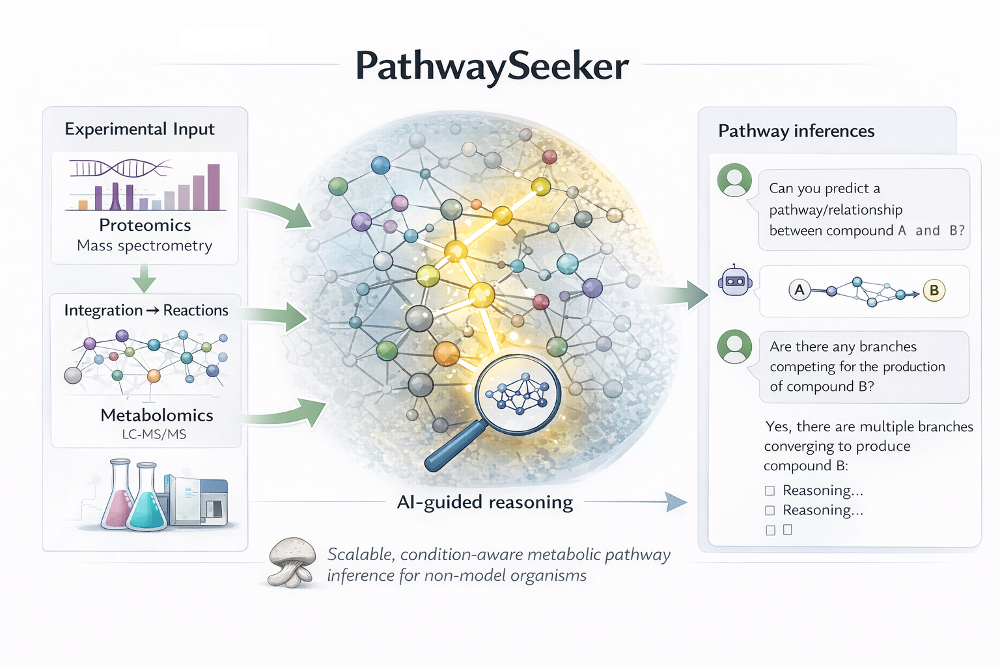

# PathwaySeeker



**Multi-omics pathway discovery with knowledge graphs and LLMs.**

PathwaySeeker integrates proteomics and metabolomics data, maps reactions, recovers balanced equations, and discovers metabolic pathways using AI. It combines a curated multi-omics pipeline with a 3-layer knowledge graph (enzyme -> reaction -> compound) and LLM-based pathway evaluation.

---

## Quick Start (< 5 minutes)

```bash
# Install
pip install -e .

# Run the demo -- opens an interactive metabolic network in your browser
pathwayseeker demo
```

That's it. No API keys, no data downloads.

### With AI features

```bash
# Set your Azure OpenAI key
export AZURE_OPENAI_API_KEY_OMICS=your-key

# Run AI demo -- searches a pathway and evaluates it with LLM
pathwayseeker demo --ai

# Search for a specific pathway
pathwayseeker search C00079 C00423 --variant baseline
```

---

## Installation

Requires **Python 3.10–3.13** and `pip`. No conda needed.

```bash
git clone https://github.com/pnnl/PathwaySeeker.git
cd PathwaySeeker
python3 -m venv .venv
source .venv/bin/activate    # Windows: .venv\Scripts\activate
pip install -e .
```

<details>
<summary><strong>Don't have Python 3.10+?</strong></summary>

Check your version:
```bash
python3 --version
```

**macOS** (Homebrew):
```bash
brew install python@3.12
python3.12 -m venv .venv
source .venv/bin/activate
pip install -e .
```

**Ubuntu/Debian**:
```bash
sudo apt install python3.12 python3.12-venv
python3.12 -m venv .venv
source .venv/bin/activate
pip install -e .
```

**Windows**: Download from [python.org](https://www.python.org/downloads/) (3.12 recommended).
</details>

### For development

```bash
pip install -e ".[dev]"
```

---

## What's in the box

### Pipeline (`pathwayseeker.pipeline`)
The 7-step multi-omics processing pipeline:
1. Extract KO numbers from proteomics
2. Map KOs to KEGG reactions
3. Retrieve compounds from reactions (filter cofactors)
4. Query KEGG for metabolite C-numbers
5. Annotate metabolites with reaction roles
6. Fetch balanced reaction equations
7. Merge proteomics + metabolomics reactions

```bash
# Run the pipeline
pathwayseeker pipeline --stage before --data-dir data/raw --output-dir data/output

# After manual curation of metabolomics_with_C_numbers.xlsx:
pathwayseeker pipeline --stage after --output-dir data/output
```

### Graph Engine (`pathwayseeker.graph`)
- **build.py** -- Build directed metabolic graph from pipeline output
- **visualize.py** -- Interactive PyVis HTML visualization
- **multilayer.py** -- 3-layer graph (enzyme/reaction/compound) with multi-level pathfinding

### AI Layer (`pathwayseeker.ai`)
- **embeddings.py** -- Azure OpenAI embeddings for graph nodes
- **link_prediction.py** -- Predict missing edges via embedding similarity
- **llm.py** -- LLM-based pathway evaluation with biochemical rubric
- **search.py** -- Search variants (baseline, embedding, LLM, link prediction)
- **eval.py** -- Unified evaluation with oracle verification
- **training.py** -- Graph indexes and training data generation for fine-tuning

### Visualization (`pathwayseeker.viz`)
Flask web app for interactive pathway exploration with Escher.js.

---

## Data

All datasets are included in the repo (~3.5 MB total):
- `data/raw/` -- Input files (proteomics, metabolomics, KO annotations)
- `data/output/` -- Pre-computed pipeline outputs + graph data

---

## Examples

| Script | API Key? | What it does |
|--------|----------|--------------|
| `examples/quickstart.py` | No | Build graph + open interactive visualization |
| `examples/quickstart_ai.py` | Yes | Search pathways + LLM evaluation |

---

## CLI Reference

```
pathwayseeker demo              # Open interactive graph visualization
pathwayseeker demo --ai         # AI pathway search demo
pathwayseeker pipeline          # Run the multi-omics pipeline
pathwayseeker search SRC TGT    # Search pathway between two compounds
```

---

## Important Notes

- Between Steps 4 and 5, **manual curation** of metabolite-to-C-number mappings is recommended.
- AI features require `AZURE_OPENAI_API_KEY_OMICS` environment variable.
- The graph can be visualized in a web browser or embedded in Jupyter.

---

## Authors

- Lummy M O Monteiro -- multi-omics pipeline, graph construction
- Marjolein T Oostrom
- Niaz Chowdhury -- AI layer, knowledge graph engine, LLM evaluation
- Sutanay Choudhury

## License

BSD 2-Clause (Battelle Memorial Institute)
