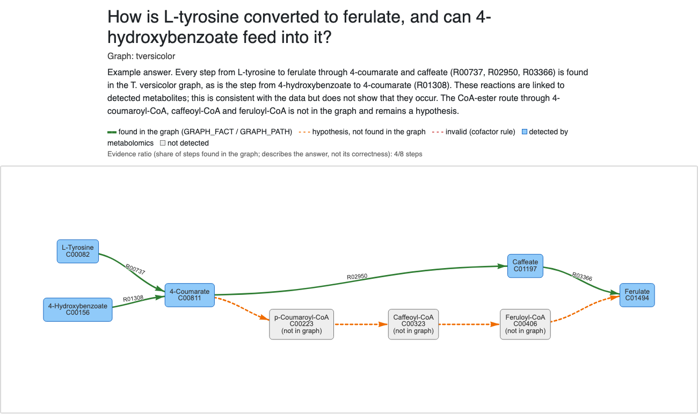

# PathwaySeeker

PathwaySeeker checks each step of a metabolic pathway proposed by an AI assistant against a
reaction graph built from an organism's proteomics and metabolomics data.

[](https://github.com/pnnl/PathwaySeeker/actions/workflows/tests.yml)
[](https://www.biorxiv.org/content/10.64898/2026.04.14.718256v1)
[](pyproject.toml)
[](LICENSE.txt)



Language models can propose plausible metabolic pathways, but they cannot tell which steps are
consistent with measurements from a particular organism. PathwaySeeker builds a graph of KEGG
reactions linked to the enzymes and metabolites detected in the data, and labels each step of
the routes an assistant proposes:

- **Solid green steps** match a reaction in the graph that is linked to a detected enzyme
  (through its KEGG Orthology annotation) or to a detected metabolite. This is consistent with
  the data; it does not show that the reaction occurs.
- **Orange dashed steps** were not found in the graph. They are not ruled out and are
  candidates for experimental testing.

In the output, a found step is labeled `GRAPH_PATH` when every step of its route was found,
and `GRAPH_FACT` when the route is a single step or also contains steps not found. Steps not
found are labeled `HYPOTHESIS`.

Graphs are stored and queried locally. Building a graph, and naming compounds that are not in
the graph, uses the KEGG REST API. Questions and results are sent to the assistant you use and
count toward your usage of that service. PathwaySeeker provides a skill for Claude Code and
Codex and an MCP server. The command line and MCP tools are tested; end-to-end use inside
Claude Code and Codex has not yet been tested.

## Installation

To have an assistant install it, paste this into Claude Code or Codex (assistant-driven setup
has not yet been tested end to end):

> Set up PathwaySeeker from https://github.com/pnnl/PathwaySeeker by following its AGENTS.md, then run the demo.

Or do it yourself:

```bash
pip install "pathwayseeker[mcp] @ git+https://github.com/pnnl/PathwaySeeker"
pathwayseeker setup     # installs the skill for Claude Code and Codex
pathwayseeker demo      # labels an example answer on the included graph and opens it
```

Start a new Claude Code or Codex session and ask, for example:

> Using the tversicolor graph, what connects phenylalanine and 4-hydroxybenzoate? Show me the pathway.

`tversicolor` is the *Trametes versicolor* graph from the paper, included for testing.

## Data from the paper

| | Location |
|---|---|
| Training data (16,422 examples) | [`data/training/training_v3.jsonl.gz`](data/training/training_v3.jsonl.gz), with a readable [sample](data/training/training_v3_sample.jsonl) and its [composition](data/training/training_v3.stats.json) |
| Evaluation queries (64) | [`evals/queries/`](evals/queries/): 60 sampled compound pairs and 4 case studies |
| Grader (LLM judge prompt and rubric) | [`evals/grader/judge_prompt_and_rubric.md`](evals/grader/judge_prompt_and_rubric.md) |
| Results and logs | [`evals/results/`](evals/results/); `python evals/table1.py` recomputes Table 1 without API calls |
| Graph used for training and evaluation | [`src/pathwayseeker/data/tversicolor/`](src/pathwayseeker/data/tversicolor/) |

Details are in [`evals/README.md`](evals/README.md).

## Repository layout

| Folder | Contents |
| --- | --- |
| `src/pathwayseeker/` | Python package: graph builder, graph queries, command line, MCP server |
| `skills/pathwayseeker/` | Skill for Claude Code and Codex |
| `data/` | *T. versicolor* input tables (`raw/`), pipeline outputs (`output/`) and training data (`training/`) |
| `evals/` | Evaluation queries, grader, results and the Table 1 script |
| `analysis/` | Original analysis code, unchanged: graph-construction scripts, notebooks and their outputs, thermodynamic analyses (`MDF/`), and the *Rhodosporidium toruloides* graph (not evaluated) |
| `pathway_viz/` | PathwayViz, an interactive pathway map with per-condition abundance charts |
| `docs/`, `examples/`, `tests/` | Documentation and images, a Python example, and tests |

`pathwayseeker build` is a packaged version of the `analysis/multiomics_graph/` pipeline;
[docs/PROVENANCE.md](docs/PROVENANCE.md) maps each original script to its package module.

## Use your own data

Tell your assistant where your files are:

> Build a PathwaySeeker graph called myorg from proteins.xlsx, ko.txt and metabolites.xlsx.

| File | What it contains |
|---|---|
| Proteomics table (`.xlsx` or `.csv`) | One row per protein, with a `proteinID` column |
| KO annotation (`.txt`) | Tab-separated protein ID, KEGG Orthology (KO) number and description, no header. Make it with [KAAS](https://www.genome.jp/kegg/kaas/), [GhostKOALA](https://www.kegg.jp/ghostkoala/) or eggNOG-mapper. |
| Metabolomics table (`.xlsx` or `.csv`) | Metabolite names in the first column, or KEGG compound IDs in a `KEGG_C_number` column |

The first build downloads reaction data from KEGG; it took about 20 minutes in our tests and
can take a few hours for larger datasets or when KEGG responds slowly. Later builds reuse the
downloads. Metabolite names are matched to KEGG by taking the first search result, so some
matches will be wrong and some names will not match (they are listed in
`unmatched_metabolites.txt`). The published graph used manually curated matches; review the
matches before using the results.

Graphs are stored in `~/.pathwayseeker/graphs/<name>/`. Saved answers are written to the
graph's `answers/` folder (for the built-in graph, `~/.pathwayseeker/answers/tversicolor/`) as
a JSON record and a pathway picture. `pathwayseeker show` opens the
latest one and `pathwayseeker show --network` opens the whole graph. Saved answers are a
record only; they are not fed back into later conversations.

## Use it from Python

```python
from pathwayseeker import Oracle, resolve_graph

graph = Oracle.from_dir(resolve_graph("tversicolor"))
graph.find_compound("ferulate")                                  # names to KEGG IDs
graph.path_search("C00079", "C01494")                            # routes in the graph
graph.label_pathway(["C00079", "C00423", "C00811", "C00156"])   # label each step
```

## More

- [pathway_viz/](pathway_viz/): PathwayViz, an interactive pathway map with abundance bar
  charts per condition.
- `pathwayseeker --help` lists every command, including `ask`, which sends questions directly
  to an OpenAI, Azure or Anthropic model (requires an API key; not yet tested against live
  models in this release).

## Limitations

- Only the *T. versicolor* graph has been evaluated.
- The graph pools all experimental conditions; it is not specific to any one condition.
- A KEGG Orthology annotation indicates enzymatic capability, not activity or substrate
  specificity. Reactions linked to a detected metabolite are included whether or not the
  catalyzing enzyme was detected.
- For reactions added through proteomics, only the first compound on each side of the KEGG
  equation is linked, so some conversions catalyzed by detected enzymes are not found (for
  example, D-glucose to D-glucose 6-phosphate, R01786).
- Step direction follows the order in which KEGG writes each equation, not the direction in
  the cell; a step can be found in one direction and not in the reverse.
- Automatic metabolite-to-KEGG matching is error-prone and should be reviewed.
- The fine-tuned model described in the paper is not distributed.
- End-to-end use inside Claude Code and Codex has not yet been tested.
- Building a graph queries the KEGG REST API, which KEGG provides for academic use; other
  users should review the [KEGG terms](https://www.kegg.jp/kegg/legal.html). Third-party
  components are listed in [THIRD_PARTY_NOTICES.md](THIRD_PARTY_NOTICES.md).

## Citation

If you use PathwaySeeker, please cite:

Monteiro, L.M.O., Chowdhury, N.B., Oostrom, M.T., McDermott, J.E., Stratton, K.G., Choudhury, S.
and Bardhan, J.P. (2026). PathwaySeeker: Evidence-Grounded AI Reasoning over Organism-Specific
Metabolic Networks. *bioRxiv*. https://doi.org/10.64898/2026.04.14.718256

```bibtex
@article{monteiro2026pathwayseeker,
  title={PathwaySeeker: Evidence-Grounded AI Reasoning over Organism-Specific Metabolic Networks},
  author={Monteiro, Lummy MO and Chowdhury, Niaz B and Oostrom, Marjolein T and McDermott, Jason E and Stratton, Kelly G and Choudhury, Sutanay and Bardhan, Jaydeep P},
  journal={bioRxiv},
  year={2026},
  doi={10.64898/2026.04.14.718256},
  publisher={Cold Spring Harbor Laboratory},
  url={https://www.biorxiv.org/content/10.64898/2026.04.14.718256v1}
}
```

## Contributors to this repository

- Lummy M. O. Monteiro - multi-omics and graph construction
- Marjolein T. Oostrom - metabolomics validation
- Niaz Bahar Chowdhury - thermodynamic validation
- Sutanay Choudhury - AI methods

## Acknowledgements

This research was supported by the Environmental Molecular Sciences Laboratory, a DOE Office of
Science User Facility sponsored by the Biological and Environmental Research program under
Contract No. DE-AC05-76RL01830.

## License

BSD 2-Clause (Battelle Memorial Institute)
