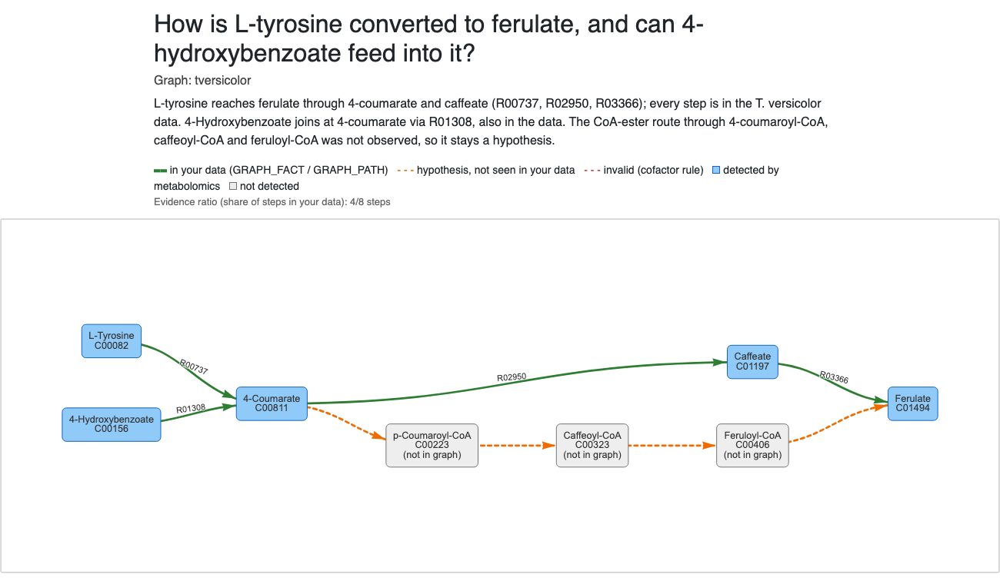

# PathwaySeeker

**Ask your AI assistant how metabolites connect in your organism, and see which steps your
own proteomics and metabolomics data actually support.**

[](https://github.com/pnnl/PathwaySeeker/actions/workflows/tests.yml)
[](https://www.biorxiv.org/content/10.64898/2026.04.14.718256v1)
[](pyproject.toml)
[](LICENSE.txt)



Language models know a lot of biochemistry, but they cannot tell you which of it happens in
*your* organism under *your* conditions. PathwaySeeker builds a network of the reactions your
measurements support and checks every step of the assistant's answer against it:

- **Green steps** are in your data, backed by detected enzymes, detected metabolites or both.
- **Orange dashed steps** are the assistant's suggestions that your data does not show. They
  may still be real; they are what you would test next.

It works with Claude Code and Codex, runs on your own machine, and needs no API keys of its
own.

## Set up in 5 minutes

Paste this into Claude Code or Codex:

> Set up PathwaySeeker from https://github.com/pnnl/PathwaySeeker by following its AGENTS.md, then run the demo.

Or do it yourself:

```bash
pip install "pathwayseeker[mcp] @ git+https://github.com/pnnl/PathwaySeeker"
pathwayseeker setup     # installs the skill for Claude Code and Codex
pathwayseeker demo      # answers a sample question and opens the picture above
```

Start a new Claude Code or Codex session and ask, for example:

> Using the tversicolor graph, what connects phenylalanine and 4-hydroxybenzoate? Show me the pathway.

`tversicolor` is the *Trametes versicolor* data from our paper, included so you can try it
right away.

## What is in this repository

The PathwaySeeker package and assistant skill were added alongside the original project,
which is unchanged:

| Folder | What it is | Main authors |
|---|---|---|
| `src/pathwayseeker/`, `skills/` | Python package, command line, MCP server and assistant skill | S. Choudhury |
| `multiomics_graph/`, `multiomics_graph_proteomics/` | Original graph-construction scripts (proteomics + metabolomics, and proteomics only) | L. M. O. Monteiro |
| `notebooks/`, `output/`, `data/` | Analysis notebooks, their outputs, and the *T. versicolor* input tables | L. M. O. Monteiro |
| `pathway_viz/` | PathwayViz, the interactive pathway map with per-condition abundance charts | M. T. Oostrom |
| `MDF/` | Thermodynamic feasibility (Max-min Driving Force) analyses | N. B. Chowdhury |
| `multiomics_graph_addiitonal/` | Graph reconstructed for *Rhodosporidium toruloides* | L. M. O. Monteiro |
| `paper/` | Training data, queries, rubric and results from the manuscript | all authors |

The package's graph builder (`pathwayseeker build`) is a packaged version of the
`multiomics_graph/` pipeline; [MIGRATION.md](MIGRATION.md) maps each original script to its
package module.

## Use your own data

Tell your assistant where your files are:

> Build a PathwaySeeker graph called myorg from proteins.xlsx, ko.txt and metabolites.xlsx.

| File | What it contains |
|---|---|
| Proteomics table (`.xlsx` or `.csv`) | One row per protein, with a `proteinID` column |
| KO annotation (`.txt`) | Tab-separated protein ID, KEGG Orthology (KO) number and description, no header. Make it with [KAAS](https://www.genome.jp/kegg/kaas/), [GhostKOALA](https://www.kegg.jp/ghostkoala/) or eggNOG-mapper. |
| Metabolomics table (`.xlsx` or `.csv`) | Metabolite names in the first column, or KEGG compound IDs in a `KEGG_C_number` column |

The first build downloads reaction data from KEGG and can take up to an hour; later builds
are fast. Your assistant can also go through the automatic metabolite-to-KEGG matches with
you, which is worth doing before you rely on the results.

Graphs are stored in `~/.pathwayseeker/graphs/<name>/`. Every checked answer is saved there
too, in `answers/`, as a JSON record and a pathway picture. `pathwayseeker show` opens the
latest one and `pathwayseeker show --network` opens the whole graph. Saved answers are a
record only; they are not fed back into later conversations.

## Use it from Python

```python
from pathwayseeker import Oracle, resolve_graph

graph = Oracle.from_dir(resolve_graph("tversicolor"))
graph.find_compound("ferulate")                                  # names to KEGG IDs
graph.path_search("C00079", "C01494")                            # routes in the data
graph.label_pathway(["C00079", "C00423", "C00811", "C00156"])   # label each step
```

## More

- [paper/](paper/README.md): the training data, evaluation queries, scoring rubric and results
  from the manuscript.
- [pathway_viz/](pathway_viz/): PathwayViz, an interactive pathway map with abundance bar
  charts per condition.
- `pathwayseeker --help` lists every command, including `ask`, which answers questions by
  calling an OpenAI, Azure or Anthropic model directly.

## Citation

If you use PathwaySeeker, please cite:

Monteiro, L.M., Chowdhury, N.B., Oostrom, M.T., McDermott, J.E., Stratton, K.G., Choudhury, S.
and Bardhan, J.P., 2026. PathwaySeeker: Evidence-Grounded AI Reasoning over Organism-Specific
Metabolic Networks. *bioRxiv*, pp.2026-04.
https://www.biorxiv.org/content/10.64898/2026.04.14.718256v1

```bibtex
@article{monteiro2026pathwayseeker,
  title={PathwaySeeker: Evidence-Grounded AI Reasoning over Organism-Specific Metabolic Networks},
  author={Monteiro, Lummy MO and Chowdhury, Niaz B and Oostrom, Marjolein T and McDermott, Jason E and Stratton, Kelly G and Choudhury, Sutanay and Bardhan, Jaydeep P},
  journal={bioRxiv},
  pages={2026--04},
  year={2026},
  publisher={Cold Spring Harbor Laboratory},
  url={https://www.biorxiv.org/content/10.64898/2026.04.14.718256v1}
}
```

## Authors

- Lummy M. O. Monteiro - multi-omics and graph construction
- Marjolein T. Oostrom - metabolomics validation
- Niaz Bahar Chowdhury - thermodynamic validation
- Sutanay Choudhury - AI methods

## License

BSD 2-Clause (Battelle Memorial Institute)
