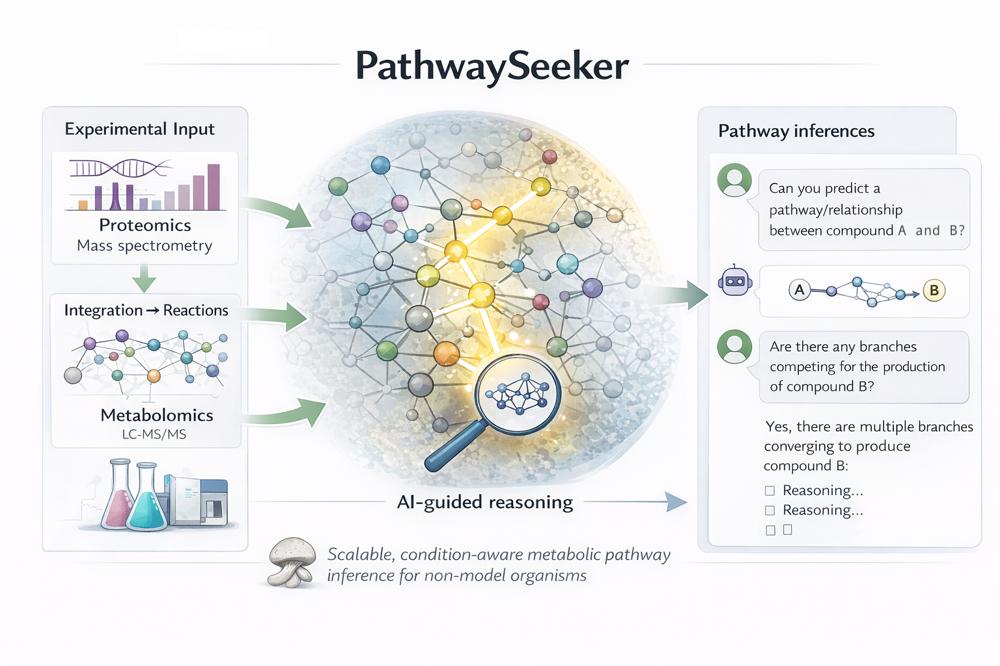

# PathwaySeeker

PathwaySeeker answers questions about metabolic relationships in multi-omics data, such as
"how is compound A converted to B in my organism?", and labels every claim with where it
came from. It builds an organism-specific graph of compounds, reactions and enzymes from
your proteomics and metabolomics measurements (KEGG identifiers throughout). A language
model, or an AI agent, proposes pathways, and a graph oracle checks each step against your
experiment:

- **GRAPH_FACT / GRAPH_PATH**: the step or whole route is present in your data
- **HYPOTHESIS**: biochemically proposed, not observed in your data (unverified, not refuted)

The oracle can only confirm. A missing edge means "not observed in this experiment", never
"impossible".



## Install

```bash
git clone https://github.com/pnnl/PathwaySeeker.git
cd PathwaySeeker
pip install -e ".[llm,mcp]"
```

Python 3.10 or later. The `llm` extra adds the OpenAI and Anthropic clients (needed only for
automated search). The `mcp` extra adds the MCP server.

## Try it (no API key)

The *Trametes versicolor* graph from the paper ships in `paper/graph_snapshot`:

```bash
export PATHWAYSEEKER_GRAPH=paper/graph_snapshot
pathwayseeker find ferulate
pathwayseeker oracle path C00079 C01494
pathwayseeker verify C00079 C00423 C00811 C00156
```

Every command prints JSON. The last command labels phenylalanine -> cinnamate -> 4-coumarate
as GRAPH_FACT edges and the final step to 4-hydroxybenzoate as a HYPOTHESIS.

## Use it from an AI agent

**Agent skill.** `skills/pathwayseeker/SKILL.md` teaches an agent to build a graph from the
user's tables and answer questions with the Oracle-in-the-Loop protocol. For Claude Code,
copy the folder into `~/.claude/skills/` (all projects) or `.claude/skills/` (one project).

**MCP server.** The same tools are available to any MCP client:

```json
{
  "mcpServers": {
    "pathwayseeker": {
      "command": "pathwayseeker",
      "args": ["mcp", "--graph", "/path/to/graph_dir"]
    }
  }
}
```

Tools: `find_compound`, `compound_exists`, `compound_neighborhood`, `reaction_participants`,
`enzyme_reactions`, `common_reactions`, `path_search`, `reaction_exists`, `verify_pathway`,
`graph_stats`.

## Build a graph from your own data

```bash
pathwayseeker build --proteomics proteins.xlsx --ko-definitions ko.txt \
    --metabolomics metabolites.xlsx --out mygraph
```

| Input | Format |
|---|---|
| Proteomics | `.xlsx` or `.csv` with a `proteinID` column (abundance columns optional) |
| KO annotation | tab-separated `proteinID`, `KO`, `description`, no header (e.g. KAAS or GhostKOALA output) |
| Metabolomics | `.xlsx` or `.csv` with metabolite names in the first column, or a `KEGG_C_number` column |

The build calls the KEGG REST API. Metabolite names are matched to KEGG automatically. To
review the matches first, run with `--stage before`, correct
`mygraph/metabolomics_with_C_numbers.xlsx`, save it as
`metabolomics_with_C_numbers_curated.xlsx`, and rerun with `--stage after`.

## Automated search without an agent

```bash
export OPENAI_API_KEY=...        # or PATHWAYSEEKER_LLM=anthropic with ANTHROPIC_API_KEY,
                                 # or PATHWAYSEEKER_LLM=azure with AZURE_OPENAI_* variables
pathwayseeker ask "How is L-phenylalanine (C00079) converted to ferulate (C01494)?" \
    --graph mygraph --organism "Trametes versicolor"
```

`ask` runs the Oracle-in-the-Loop search: hypothesize, query the graph, evaluate, refine,
select, synthesize. Every edge in the answer is labeled by the oracle, not the model. Any
OpenAI-compatible endpoint works via `OPENAI_BASE_URL`. A fine-tuned deployment can be
selected with `--model`.

From Python:

```python
from pathwayseeker import Oracle
from pathwayseeker.reasoning import OitLSearch, get_llm

oracle = Oracle.from_dir("mygraph")
result = OitLSearch(oracle, get_llm(), organism="Trametes versicolor").search(
    "How is C00079 converted to C01494?")
```

## Fine-tuning data and evaluation

- `pathwayseeker train-data --graph-dir mygraph --balanced --output train.jsonl` generates
  schema-aware training examples (GRAPH_FACT, GRAPH_PATH, HYPOTHESIS, NO_PATH, INVALID) in
  OpenAI chat fine-tuning format.
- `pathwayseeker eval --queries paper/queries/*.json --graph paper/graph_snapshot` reports
  the Experimental Evidence Ratio and LLM-judge scores for a query set.

## Reproducing the paper

`paper/` holds the graph snapshot, the 64 evaluation queries, the 16,422-example training
set, the raw evaluation output with logs, and `paper/table1.py`, which recomputes Table 1
without API calls. See [paper/README.md](paper/README.md).

## Repository layout

| Path | Contents |
|---|---|
| `src/pathwayseeker/` | package: `pipeline` (graph build), `oracle`, `reasoning` (search, LLM adapters), `training`, `evaluation`, `mcp_server`, `cli` |
| `skills/pathwayseeker/` | agent skill |
| `paper/` | manuscript data, queries, results and Table 1 script |
| `data/raw`, `data/output` | *T. versicolor* inputs and current pipeline outputs |
| `data/other_organisms/` | graph reconstructed for *Rhodosporidium toruloides* |
| `pathway_viz/` | PathwayViz, the interactive Escher-based pathway viewer (see its README) |
| `MDF/` | thermodynamic (Max-min Driving Force) analyses with eQuilibrator (`pip install -e ".[thermo]"`) |
| `notebooks/`, `multiomics_graph*/` | original exploratory notebooks and scripts |

## Citation

Monteiro L.M.O., Chowdhury N.B., Oostrom M.T., McDermott J.E., Stratton K.G., Choudhury S.,
Bardhan J.P. PathwaySeeker: Evidence-Grounded AI Reasoning over Organism-Specific Metabolic
Networks. (Under review.)

## Authors

- Lummy M. O. Monteiro - multi-omics and graph construction
- Marjolein T. Oostrom - metabolomics validation
- Niaz Bahar Chowdhury - thermodynamic validation
- Sutanay Choudhury - AI methods

## License

BSD 2-Clause (Battelle Memorial Institute)
